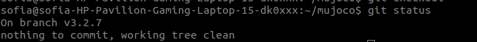
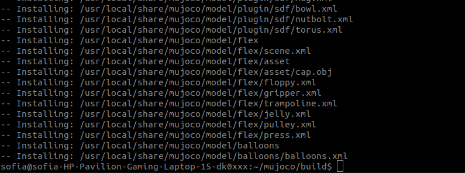
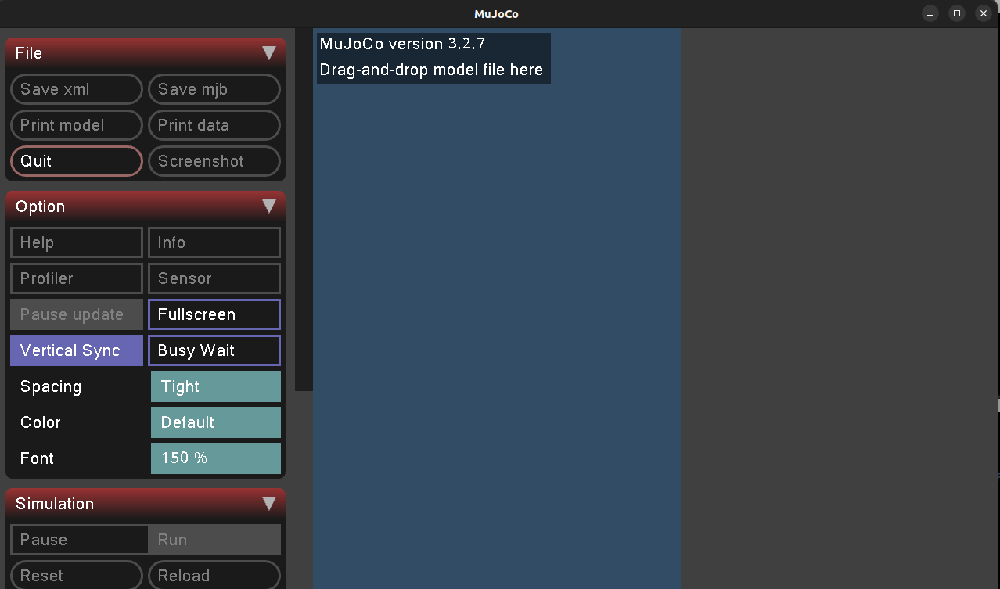
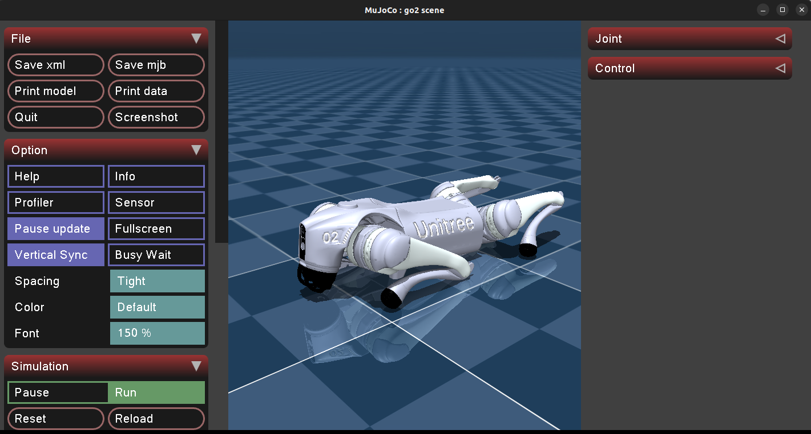
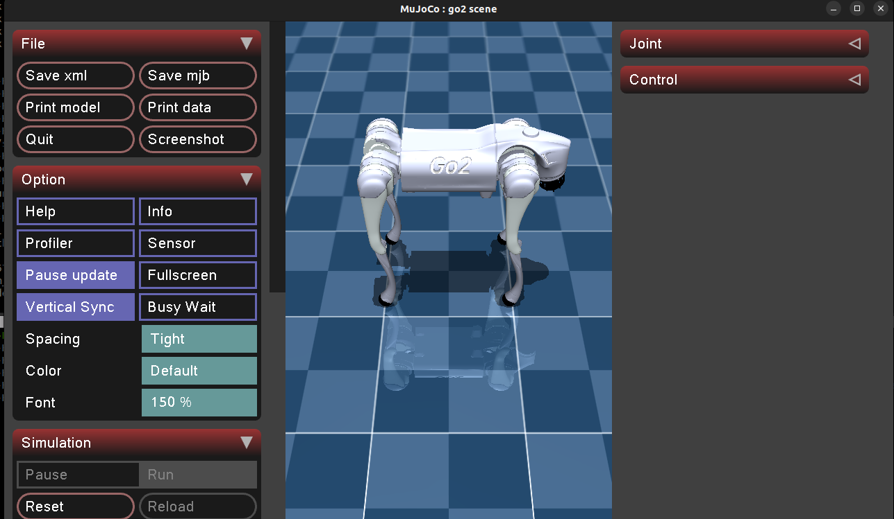
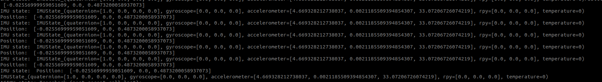

# Instalación de Unitree Mujoco

## Requerimientos

* Ubuntu 20.04 o superior
* [CMake](https://cmake.org/)
* Compilador compatible con C++11 o superior

## 1. Instalar dependencias de Mujoco

En una terminal ejecuta:

```bash
sudo apt update
sudo apt install libglfw3-dev libxinerama-dev libxcursor-dev libxi-dev
```

## 2. Descargar Mujoco (versión 3.2.7)

Clona el repositorio oficial y cambia al tag correspondiente:

```bash
git clone https://github.com/google-deepmind/mujoco.git
cd mujoco
git checkout tags/3.2.7
```

Al final verifica si nos encontramos en esta rama:


## 3. Construir Mujoco

Dentro de la carpeta ` cd ~/mujoco` construimos el simulador:

```bash
mkdir build && cd build
cmake ..
make -j4
sudo make install
```

Al final la construcción termina asi:


### 📌 Resultado esperado

Al ejecutar en  cd ~/mujoco/build`

```bash
simulate
```

Debería abrirse la ventana del simulador Mujoco ✅.


## 4. Instalar `yaml-cpp`

`yaml-cpp` se usa para leer archivos de configuración:

```
sudo apt install libyaml-cpp-dev
```

## 5. Compilar **Unitree Mujoco**

Clona el repositorio e instala, es necesario tener correctamente instaladas [unitree_sdk2](/docs/Instalacion_unitree_sdk2.md) y [unitree_sdk2_python](/docs/Instalacion_unitree_sdk2_python.md) :

```bash
git clone https://github.com/unitreerobotics/unitree_mujoco.git
cd unitree_mujoco/simulate
mkdir build && cd build
cmake ..
make -j4
```

## 6. Probar la instalación

Ejecuta el simulador con el robot Go2 dentro de `cd ~/unitree_mujoco/simulate/build`:

```bahs
./unitree_mujoco -r go2 -s scene_terrain.xml
```

Deberías ver el robot Go2 cargado en Mujoco.



## 7. Alternativa en Python

También puedes usar Mujoco con Python para simulación más rápida.

### Instalar dependencias en Python

```bash
pip3 install mujoco pygame
```

### Probar en Python

Una vez clonado el repositorio con la primer linea del **paso 5**  realizar los siguientes pasos:

```bash
cd ~/unitree_mujoco/simulate_python
python3 ./unitree_mujoco.py
```

Deberías ver el robot Go2 cargado en Mujoco.



En otra terminal en `cd ~/unitree_mujoco/simulate_python`:

```bash
python3 ./test/test_unitree_sdk2.py
```

### 📌 Resultado esperado

El programa imprimirá la pose y posición del robot, y cada motor aplicará 1Nm de torque.


## Posibles errores y soluciones

### Error: librerías de Mujoco no encontradas

Si al ejecutar `simulate` aparece un error de librerías, asegúrate de tener `/usr/local/lib` en tu `LD_LIBRARY_PATH`:

```bash
export LD_LIBRARY_PATH=/usr/local/lib:$LD_LIBRARY_PATH
echo 'export LD_LIBRARY_PATH=/usr/local/lib:$LD_LIBRARY_PATH' >> ~/.bashrc
source ~/.bashrc
```

### Error: dependencias faltantes

* `yaml-cpp/yaml.h: No such file or directory` → instalar `libyaml-cpp-dev`.
* `eigen3/Eigen/Dense: No such file or directory` → instalar `libeigen3-dev`.

🔗 Referencia original: [Unitree Mujoco](https://github.com/unitreerobotics/unitree_mujoco)

