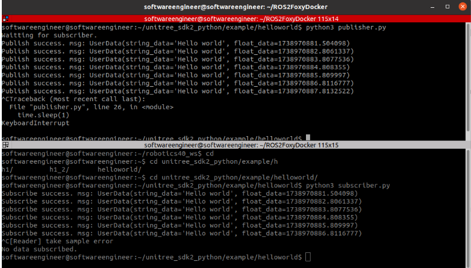

# Instalación SDK2 python de Unitree

## Dependencias

- Python >= 3.8
- cyclonedds == 0.10.2
- numpy
- opencv-python

## Opción A. Instalar usando pip

Si se desea usar pip se debe abrir una terminal y ejecutar

```bash
pip install unitree_sdk2py
```

## Opción B. Instalar desde la fuente (trabajado por Robotics 4.0)

```bash
cd ~
sudo apt install python3-pip
git clone https://github.com/unitreerobotics/unitree_sdk2_python.git
cd unitree_sdk2_python
pip3 install -e .
```

## Validación de correcta ejecución

### Ejecutar publicador

Se abre una terminal y se ejecuta:

```bash
cd
cd unitree_sdk2_pyhton/example/hello_world
python3 publisher.py
```

### Ejecutar suscriptor

Se abre una terminal nueva y se ejecuta:

```bash
cd
cd unitree_sdk2_pyhton/example/hello_world
python3 subscriber.py
```

El resultado que debe evidenciarse es:


Ya se encuentra lista la librería para su desarrollo!

