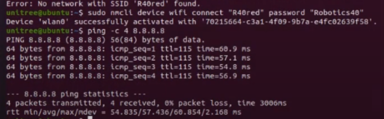

# Conexión a Internet con WiFi en PC2

## Objetivo

Verificar la conexión WiFi del G1 de Unitree, asegurando que el robot pueda acceder a una red inalámbrica y establecer conexión a Internet.

## Requerimientos Previos

- **Robot G1 encendido y conectado vía Ethernet** para acceso inicial.
- **Credenciales de acceso** a la red WiFi.
- **Acceso SSH** al PC2 del G1.

## Acceso al PC2 del G1

Desde el computador, conectarse al PC2 del robot mediante SSH:

```bash
ssh unitree@192.168.123.164
```

Ingresar la contraseña cuando se solicite: 123

## Configuración del WiFi en Modo STA

Ejecutar los siguientes comandos para habilitar y configurar la conexión WiFi:

* Desbloquear interfaces de red (si están bloqueadas)
  
  ```bash
  sudo rfkill unblock all
  ```
* Habilitar la interfaz WiFi
  
  ```bash
  sudo ifconfig wlan0 up
  ```
* Encender la radio WiFi
  
  ```bash
  sudo nmcli radio wifi on
  ```
* Conectar a la red WiFi especificada
  
  ```bash
  sudo nmcli device wifi connect "NOMBRE_DE_RED" password "CONTRASEÑA"
  ```
* Verificar que la conexión está activa
  
  ```bash
  nmcli connection show --active
  ```
  
  Si la conexión se estableció correctamente, este comando mostrará la red WiFi conectada.

## Verificación de Conectividad a Internet

Para probar acceso a Internet:

```bash
ping -c 4 8.8.8.8
```



Si hay respuesta, la conexión a Internet está funcionando.
Si no hay respuesta, verificar la ruta de conexión:

```bash
ip route
```

Se espera ver una salida similar a:

```bash
default via 192.168.X.1 dev wlan0
```

Donde 192.168.X.1 representa la dirección del gateway de la red.

## Resolución de Problemas (Troubleshooting)

### La red WiFi no se muestra o no se conecta

Intentar conectar a una red diferente (por ejemplo, un hotspot desde un celular) para descartar problemas de permisos en la red institucional.

Verificar el estado del WiFi con:

```bash
rfkill list
```

Si aparece Soft blocked: yes, significa que el WiFi está bloqueado por software. Para desbloquearlo:

```bash
sudo rfkill unblock wifi
sudo nmcli radio wifi on
```

### No hay acceso a Internet a pesar de estar conectado a la red

Para comprobar la conexión:

```bash
nmcli connection show
```

Si hay restricciones, deshabilitar el firewall temporalmente y probar:

```bash
sudo ufw disable
```

Reiniciar el servicio de red:

```bash
sudo systemctl restart NetworkManager
```

Si la ruta default no aparece en ip route, agregarla manualmente:

```bash
sudo ip route add default via 192.168.X.1 dev wlan0
```

(Reemplazar 192.168.X.1 con la dirección del gateway de la red conectada.)

