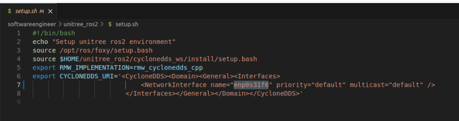
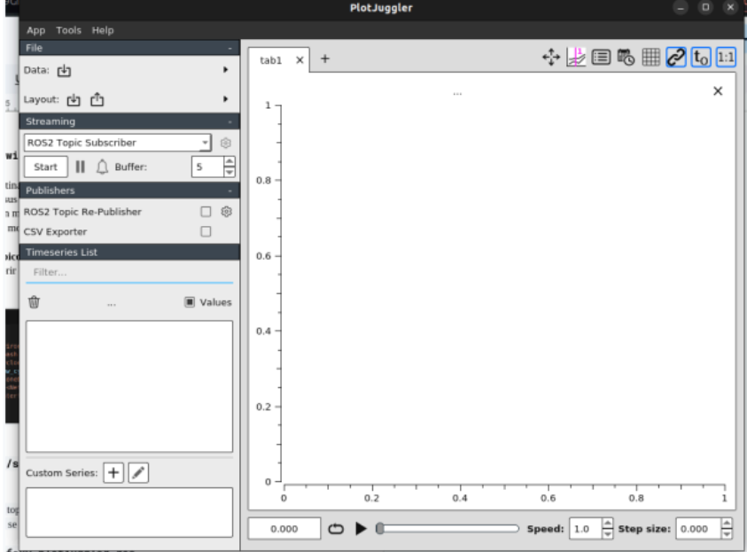
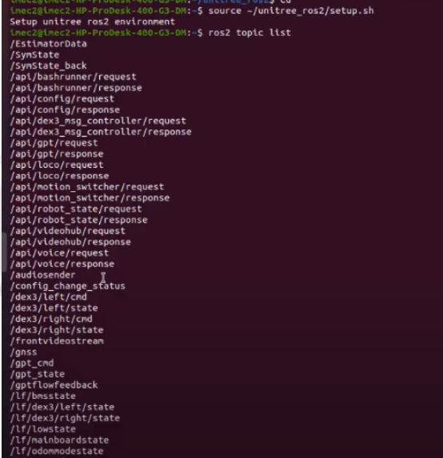

# **Protocolo de Pruebas – Acceso a Información de Sensores con PlotJuggler**

## **Objetivo**

Verificar la correcta recepción y visualización de datos de los sensores del **robot G1 de Unitree** mediante **ROS 2** y la herramienta **PlotJuggler**.

## **Requerimientos Previos**

**Robot G1 encendido y conectado a la red** (con la IP correctamente configurada).
**PC con ROS 2 instalado y unitree\_ros2 configurado**.
**Conexión estable entre el robot y el PC** (verificar con `ping 192.168.123.161`).

## **Configuración de la Red y Entorno de ROS 2**

1. **Abrir el archivo de configuración `setup.sh`** en el directorio **unitree\_ros2** para establecer la dirección IP modificando la linea donde se define, guardar los cambios y cerrar.

3. **Ejecutar el script de configuración** para actualizar la conexión con ROS 2:

```bash
source~/unitree_ros2/setup.sh
```

## **Visualización de Datos con PlotJuggler**

### **Instalación de PlotJuggler**

Si la herramienta **PlotJuggler** no está instalada, ejecuta:

```bash
sudo apt install ros-foxy-plotjuggler-ros
```

📌 *Nota:* Este comando instala PlotJuggler en **ROS 2 Foxy**. Si usas una versión diferente de ROS 2, cambia `foxy` por la versión correspondiente (ej. `humble`, `galactic`).

### **Ejecución de PlotJuggler**

Para iniciar la interfaz gráfica de **PlotJuggler**, usa el siguiente comando:

```bash
ros2 run plotjuggler plotjuggler
```

Al ejecutarse, se abrirá la ventana principal de la herramienta.



### **Configuración de la Interfaz en PlotJuggler**

Una vez dentro de la interfaz:

1. Asegurarse de estar en la opción **ROS 2 Topic Subscriber**.
2. Presionar el botón **Start** para comenzar la lectura de datos.
3. Seleccionar los tópicos disponibles y agregarlos a la interfaz de visualización.
4. Arrastrar y soltar los datos en la gráfica para analizarlos en tiempo real.

## **Monitoreo de Tópicos en ROS 2**

Antes de seleccionar los datos en **PlotJuggler**, se recomienda inspeccionar los tópicos disponibles en **ROS 2** con los siguientes comandos:

### **Listar todos los tópicos publicados**

```bash
ros2 topic list
```

Este comando mostrará una lista de todos los tópicos que están siendo transmitidos en el sistema ROS 2.

Ejemplo de salida:


### **Ver la información de un tópico en tiempo real**

Para visualizar los datos que se están transmitiendo en un tópico específico, usa:

```bash
ros2 topic echo /nombre_del_topic
```

📌 *Esto permite verificar en consola si el sensor está transmitiendo datos antes de visualizarlo en PlotJuggler.*

