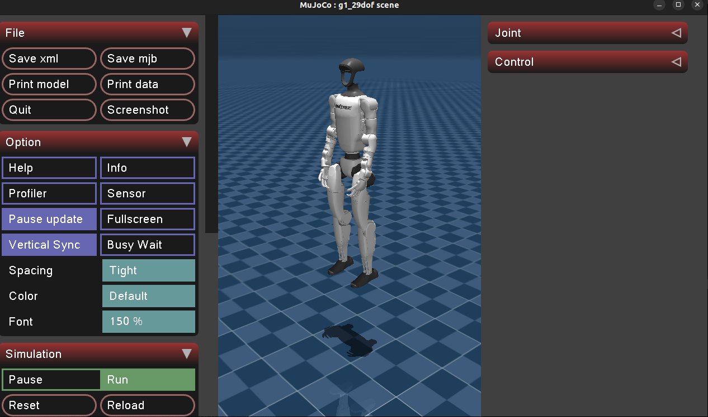
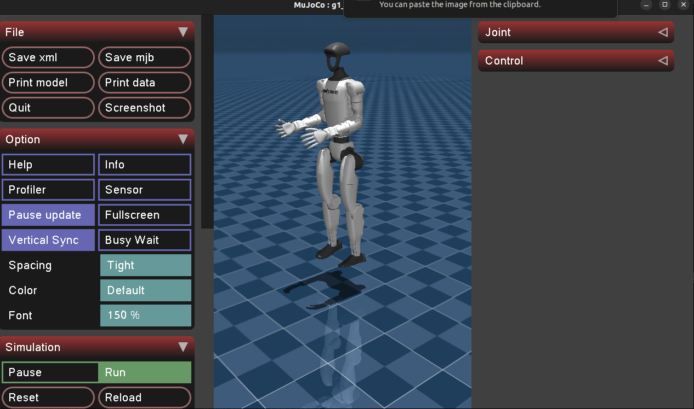
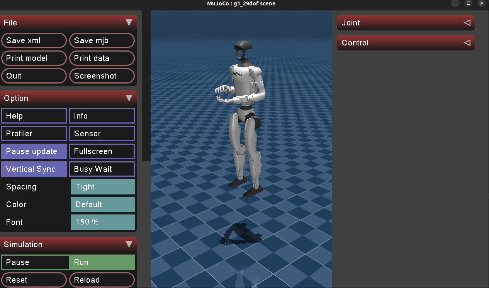

# Interacción del Simulador Unitree Mujoco con el Robot G1

Una vez realizados los pasos de la guía [docs/Instalación_recursos_simulación.md](docs/Instalación_recursos_simulación.md).

## 1. Configuración de la simulación

El archivo de configuración para el simulador en C++ se encuentra en:

```
unitree_mujoco/simulate/config.yaml
```

Ejemplo del contenido:

```yaml
# Robot name loaded by the simulator
# "go2", "b2", "b2w", "h1"
robot: "go2"
# Robot simulation scene file
# For example, for go2, it refers to the scene.xml file in the /unitree_robots/go2/ folder
robot_scene: "scene.xml"
# DDS domain id, it is recommended to distinguish from the real robot (default is 0 on the real robot)
domain_id: 1

use_joystick: 1 # Simulate Unitree WirelessController using a gamepad
joystick_type: "xbox" # support "xbox" and "switch" gamepad layout
joystick_device: "/dev/input/js0" # Device path
joystick_bits: 16 # Some game controllers may only have 8-bit accuracy

# Network interface name, for simulation, it is recommended to use the local loopback "lo"
interface: "lo"
# Whether to output robot link, joint, sensor information, 1 for output
print_scene_information: 1
# Whether to use virtual tape, 1 to enable
# Mainly used to simulate the hanging process of H1 robot initialization
enable_elastic_band: 0 # For H1
```

Para el ​**G1**​, es necesario configurar:

```
enable_elastic_band: 1
```

Esto permite simular el proceso de suspensión del robot al inicio.

## 2. Cargar el simulador con G1

Dentro de la carpeta de compilación:

```bash
cd ~/unitree_mujoco/simulate/build
```

Ejecuta el simulador especificando el robot **G1** y una de las escenas disponibles:

```bash
./unitree_mujoco -r g1 -s scene_23dof.xml
./unitree_mujoco -r g1 -s scene_29dof.xml
./unitree_mujoco -r g1 -s scene_29dof_terrain.xml
./unitree_mujoco -r g1 -s scene_29dof_with_hand.xml
```

📌 Resultado esperado: El robot aparecerá colgado en el simulador.


* Tecla **7** → sube el robot.
* Tecla **8** → baja el robot.
* Tecla **9** → descolgar al robot.

## 3. Ejemplos en Python para G1

En el directorio `simulate_python/test` puedes descargar los siguientes archivos que se encuentran en la carpeta **Codigos simulacion** del repositorio:

```bash
g1_arms_example.py
g1_low_level_example.py
test_unitree_sdk2_mod.py
```

Además, se incluyen archivos `.txt` con rutinas de gestos, por ejemplo:

```txt
aplaudir.txt
saludoR.txt
```

Todos estos archivos deben estar en la misma carpeta para que puedan ejecutarse correctamente.

### Ejemplo 1: `g1_low_level_example.py`

Ejecuta:

```bash
cd ~/unitree_mujoco/simulate_python/test
python3 g1_low_level_example.py
```

📌 Resultado esperado:
El robot realiza una ​**secuencia temporizada de movimiento de tobillos y brazos**​.



### Ejemplo 2: `g1_arms_example.py`

Ejecuta:

```bash
python3 g1_arms_example.py
```

Este script permite ​**interpolación básica de posiciones de brazos en secuencia**​.
El gesto a ejecutar se selecciona al final del código en la sección de rutina:

```python
# Opción 2: cargar desde archivo externo
# routine = custom.executor.load_routine("rutina.json")   # JSON
routine = custom.load_routine("aplaudir.txt")    # TXT
```

Para probar diferentes gestos, basta con reemplazar `"aplaudir.txt"` por cualquiera de los archivos `.txt` disponibles, por ejemplo `"saludoR.txt"`.

📌 Resultado esperado:
El robot ejecuta el gesto de brazos definido en el archivo `.txt`.



## 4. Notas adicionales

* Estos ejemplos operan en ​**bajo nivel**​, pensados para ilustrar el control directo de motores.
* Para ampliar las rutinas puedes crear tus propios archivos `.txt` siguiendo el formato de los ejemplos.
* El simulador conserva la numeración de motores real, lo que facilita la transferencia a hardware físico (sim-to-real).

